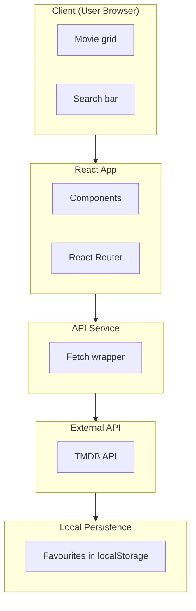
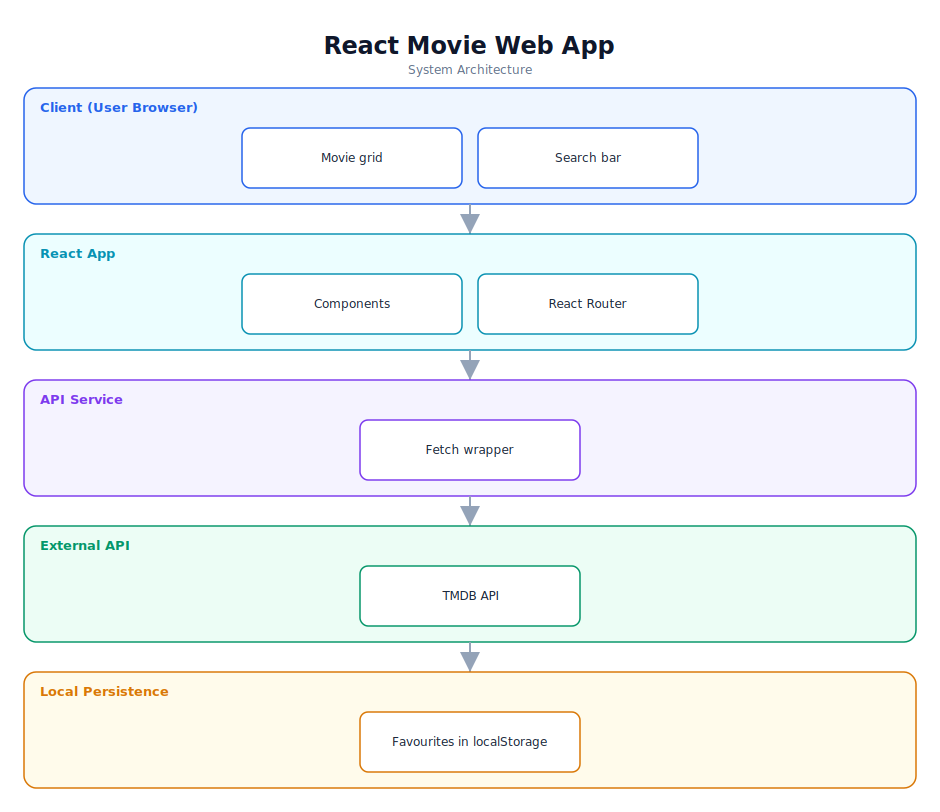

# React Movie Web App — Software Documentation

> Browse, search, and favourite movies using the TMDB API.

**Repository:** [`React-movie-website`](https://github.com/Monametsi-s/React-movie-website)  
**Type:** Single-page web application  
**Status:** Complete / functional

---

## 1. Overview

A React single-page application for browsing and exploring movies. It fetches data from The Movie Database (TMDB) API, lets users search by title, view popular and new releases, and mark favourites. Routing is handled with React Router and the layout is fully responsive.

## 2. System Architecture

The diagram below shows the high-level architecture and how data flows between layers. It renders automatically on GitHub (Mermaid) and is also committed as a vector image ([`architecture.svg`](architecture.svg)).



<p align="center"></p>

### 2.1 Component responsibilities

| Layer | Responsibility |
|---|---|
| **Client** | Renders the movie grid and search experience. |
| **React app** | Components and client-side routing. |
| **API service** | Wraps fetch calls to TMDB. |
| **External API** | TMDB provides movie data. |
| **Local persistence** | Stores favourites in localStorage. |

## 3. Technology Stack

| Area | Technology |
|---|---|
| Framework | React |
| Routing | React Router |
| Styling | CSS/SCSS |
| Data | TMDB API |
| Storage | localStorage |

## 4. Assumed User Requirements

_These requirements are inferred from the project's purpose and feature set; they document the intended behaviour rather than a formally agreed specification._

### 4.1 Functional requirements

- **FR-01** — Display popular and newly released movies.
- **FR-02** — Search for movies by title.
- **FR-03** — Mark and view favourite movies.
- **FR-04** — Show responsive layouts across devices.
- **FR-05** — Handle loading and empty/error states.

### 4.2 Representative user stories

- As a user, I want to find a movie by typing its title.
- As a user, I want to keep a list of favourites.
- As a user, I want the site to work on my phone.

### 4.3 Non-functional requirements

- The TMDB API key must be configured via environment variable.
- Searches should feel responsive.
- The UI must be responsive.

## 5. Assumed System Requirements

### 5.1 End-user (runtime) requirements

- A modern desktop or mobile web browser (latest Chrome, Edge, Firefox, or Safari) with JavaScript enabled.
- A stable internet connection for the initial page load.

### 5.2 Server / hosting requirements

- None — this project runs entirely on the client; no application server is required.

### 5.3 External services & API keys

- TMDB API key.

### 5.4 Developer / build requirements

- Node.js 18+ and npm (or yarn/pnpm).
- Git for cloning the repository.
- A code editor such as VS Code (recommended).
- `.env` with the TMDB API key.

## 6. Data Model

Favourites persisted locally as an array of TMDB movie ids; movie details fetched on demand.

## 7. Setup & Installation

```bash
git clone https://github.com/Monametsi-s/React-movie-website.git
cd React-movie-website
npm install
# add .env with your TMDB API key
npm run dev
```

## 8. Assumptions & Future Considerations

- Add loading/empty/error states everywhere.
- Persist favourites across devices (optional backend).
- Deploy a live demo (Netlify/Vercel).

---

<sub>This document was generated as part of a portfolio-wide documentation pass. User and system requirements are **assumed** from the codebase, README, and project intent, and should be validated against real product goals before being treated as authoritative.</sub>
